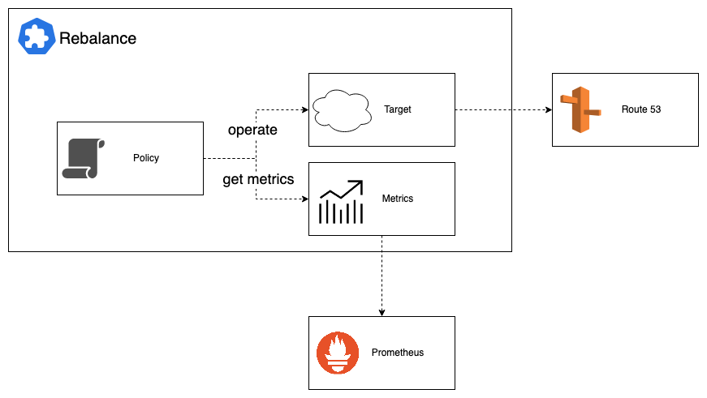

# rebalacner
Rebalancer は指定したポリシーに基づき外部のメトリクスを参照して複数環境間の重み付けを調整するための Kubernetes Operator です。

## Description

## Getting Started
実行するのに Kubernetes クラスタが必要です。ローカル環境で検証するには [KIND](https://sigs.k8s.io/kind) を利用してください。

### Running on the cluster
1. Install Instances of Custom Resources:

```sh
make install
```

2. Build and push your image to the location specified by `IMG`:
	
```sh
make docker-build docker-push IMG=<some-registry>/rebalance-controller:tag
```
	
3. Deploy the controller to the cluster with the image specified by `IMG`:

```sh
make deploy IMG=<some-registry>/rebalance-controller:tag
```

### Uninstall CRDs
To delete the CRDs from the cluster:

```sh
make uninstall
```

### Undeploy controller
UnDeploy the controller to the cluster:

```sh
make undeploy
```

## Architecture



Policyはどのような戦略で重み付けをするかの設定です。

Targetは重み付けの操作対象でRoute53のweightedレコードなどを設定します。現在のweightを取得したり、Policyによって決定されたweightに更新されます。

MetricsはPrometheus等のメトリクスサーバーと実行するクエリを設定します。Policyが最適なweightを計算するのに使われます。

## Rebalance example

次の例は、prometheusで`test-svc`への分間リクエスト数が1000 req/min以下になるようtargetで指定しているRoute53のexample.com Aレコードのweightを自動調整する設定です。

基準となるレコードのweightが8に設定されているため、spec.policy.targettracking.baseValueが8に設定されています。

このとき3000req/minあった場合、targetのweightは16に設定されます。

```yaml
apiVersion: rebalancer.ch1aki.github.io/v1
kind: Rebalance
metadata:
  name: aws-env
spec:
  dryRun: true
  interval: 1m
  policy:
    targettracking:
      targetValue: 1000 # metricsで維持してほしい値
      baseValue: 8 # ベースとなるweight
  target:
    route53:
      hostedZoneID: hostedzone/XXXXXXXXXX
      region: ap-northeast-1
      resource:
        name: example.com
        type: A
        identifier: aws
      auth:
        secretRef:
          accessKeyIDSecretRef:
            name: rebalancer-aws-secret
            key: access-key
          secretAccessKeySecretRef:
            name: rebalancer-aws-secret
            key: secret-access-key
  metrics:
    prometheus:
      address: http://prometheus-operated-exposed.nke-system.svc.cluster.local:9090
      timeout: 30
      query: |-
        sum(irate(istio_requests_total{reporter="source",destination_service_name=~"test-svc"}[5m]))
```

## Contributing

### How it works
このプロジェクトはKubernetes [Operator pattern](https://kubernetes.io/ja/docs/concepts/extend-kubernetes/operator/) に従うことを目指します。

クラスターで目的の状態に達するまでリソースを同期する調整機能を提供する [Controller](https://kubernetes.io/ja/docs/concepts/architecture/controller/) を利用します。

### Test It Out

1. 開発ツールを[aqua](https://aquaproj.github.io/docs/overview/)を利用してインストールします:

```sh
aqua install
```

2. 開発用のローカルkindクラスタを起動します:

```sh
make start
```

3. [Tilt](https://tilt.dev/)を起動します:

```sh
tilt up
```
